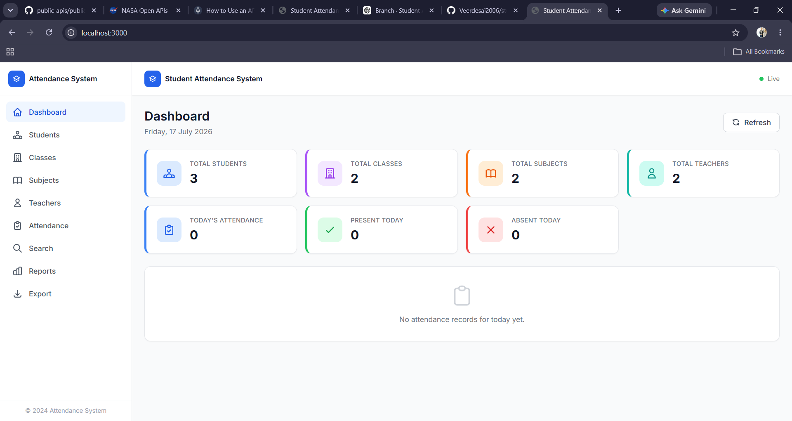
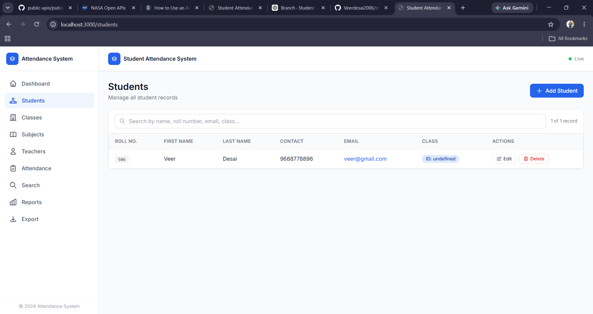
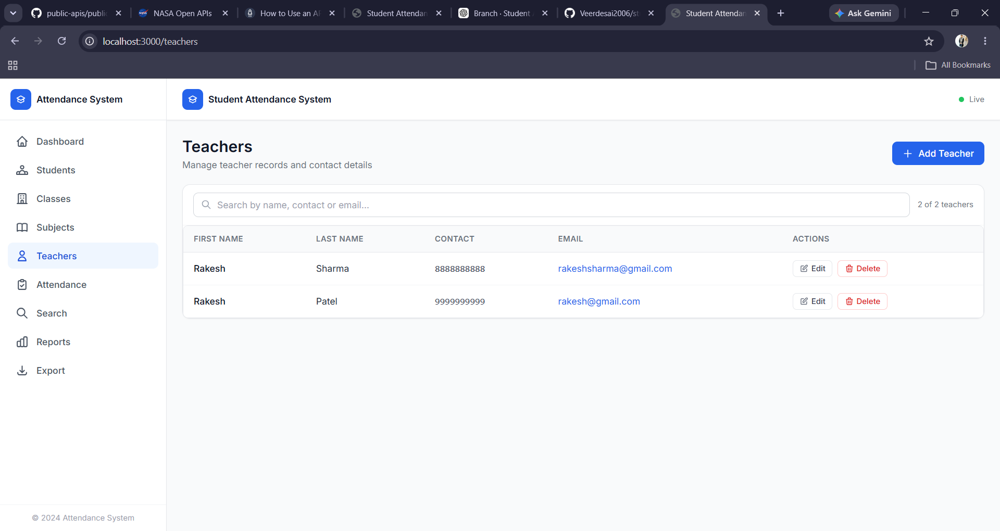
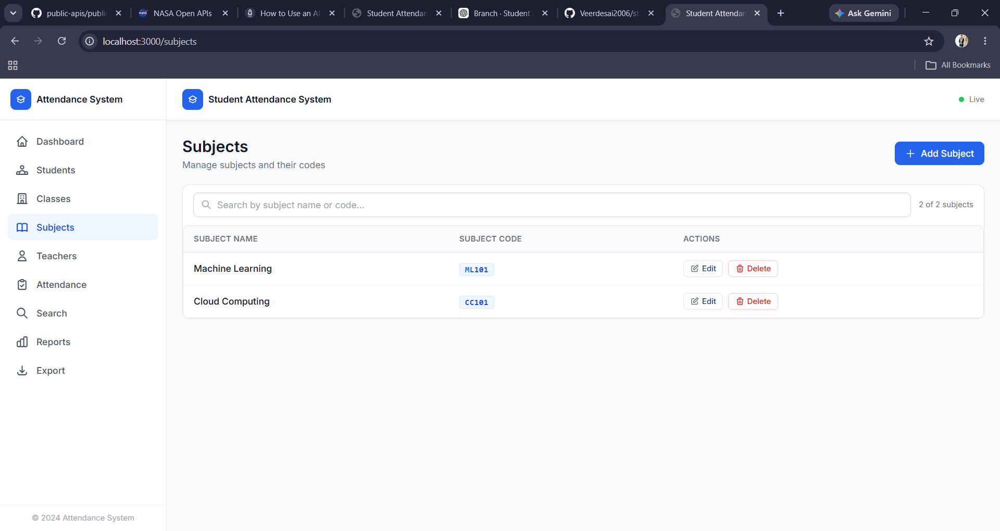
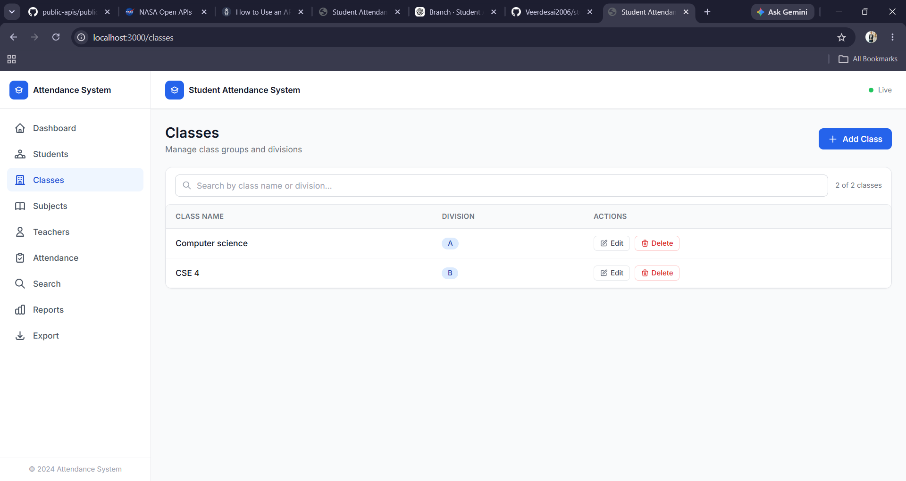
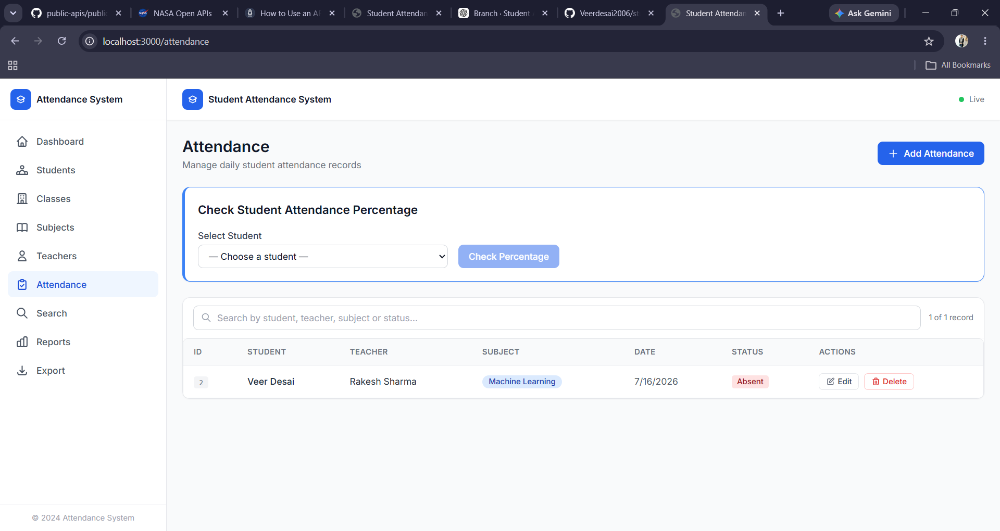
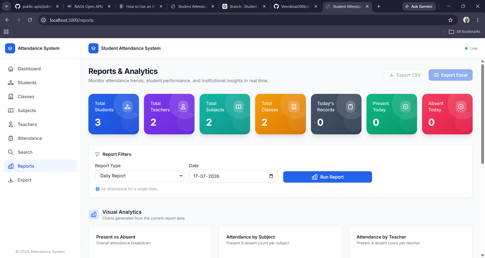
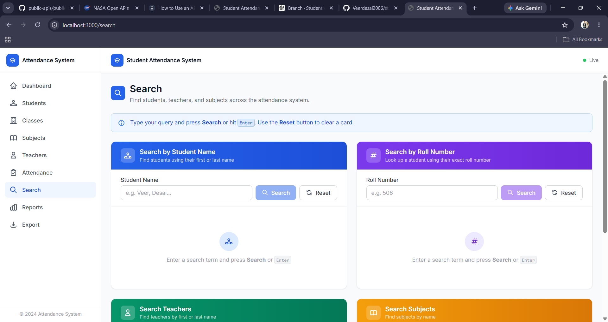

# 🎓 Student Attendance Management System

A full-stack Student Attendance Management System built with **Flask**, **PostgreSQL**, **React (Vite)**, and **Tailwind CSS**. The application allows educational institutions to efficiently manage students, teachers, classes, subjects, and attendance records through an intuitive web interface.

---

## 📌 Features

### Dashboard
- View an overview of the attendance system
- Quick navigation to all modules

### Student Management
- Add new students
- Update student information
- Delete students
- View all students

### Teacher Management
- Add teachers
- Edit teacher details
- Delete teachers
- View teacher records

### Subject Management
- Add subjects
- Update subject details
- Delete subjects

### Class Management
- Create classes
- Assign teachers and subjects
- Update class information
- Delete classes

### Attendance Management
- Mark attendance
- Update attendance records
- Delete attendance records
- View attendance history

### Search
- Search students
- Search teachers
- Search classes
- Search attendance records

### Reports
- Generate attendance reports
- View attendance statistics

### Export
- Export attendance data to CSV

---

# 🛠 Tech Stack

## Frontend
- React.js
- Vite
- Tailwind CSS
- JavaScript

## Backend
- Flask
- Python

## Database
- PostgreSQL

## Tools
- Git
- GitHub
- pgAdmin
- VS Code

---

# 📂 Project Structure

```text
student_attendace_system/
│
├── database/
│   ├── schema.sql
│   └── sample_data.sql
│
├── student_attandence_backend/
│   ├── api/
│   ├── config/
│   ├── models/
│   ├── routes/
│   ├── app.py
│   └── requirements.txt
│
├── student_attandence_frontend/
│   ├── src/
│   ├── public/
│   ├── package.json
│   └── vite.config.js
│
├── screenshots/
│
├── .gitignore
└── README.md
```

---

# 🚀 Installation

## Clone Repository

```bash
git clone https://github.com/Veerdesai2006/student_attendace_system.git
```

```bash
cd student_attendace_system
```

---

# 🗄 Database Setup

Create a PostgreSQL database.

```sql
CREATE DATABASE student_attendance;
```

Restore the database schema.

```bash
psql -U postgres -d student_attendance -f database/schema.sql
```

Load sample data.

```bash
psql -U postgres -d student_attendance -f database/sample_data.sql
```

---

# ⚙ Backend Setup

Go to backend folder.

```bash
cd student_attandence_backend
```

Create virtual environment.

```bash
python -m venv venv
```

Activate environment.

### Windows

```bash
venv\Scripts\activate
```

Install dependencies.

```bash
pip install -r requirements.txt
```

Run Flask server.

```bash
python app.py
```

---

# 💻 Frontend Setup

Open another terminal.

```bash
cd student_attandence_frontend
```

Install dependencies.

```bash
npm install
```

Run the React application.

```bash
npm run dev
```

---

# 📸 Screenshots

## Dashboard



---

## Students



---

## Teachers



---

## Subjects



---

## Classes



---

## Attendance



---

## Reports



---

## Search



# 📈 Future Improvements

- User authentication
- Role-based access control
- Attendance analytics dashboard
- PDF report generation
- Email notifications
- QR code attendance
- Face recognition attendance
- Mobile responsive interface
- Docker deployment
- Cloud deployment

---

# 👨‍💻 Author

**Veer Desai**

GitHub:
https://github.com/Veerdesai2006

---

# ⭐ If you found this project useful

Please consider giving it a ⭐ on GitHub.
